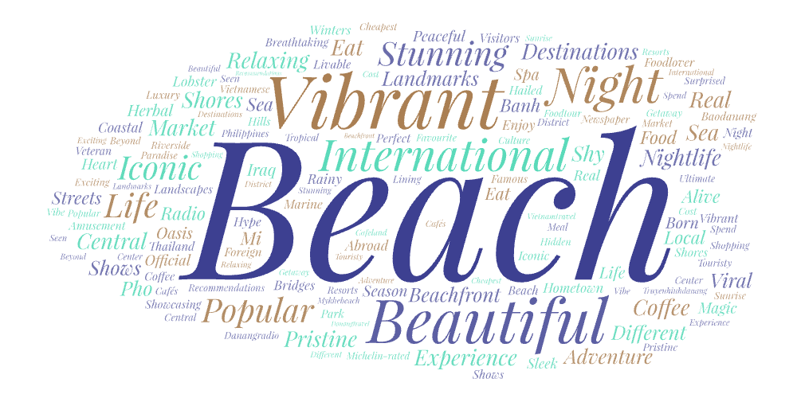
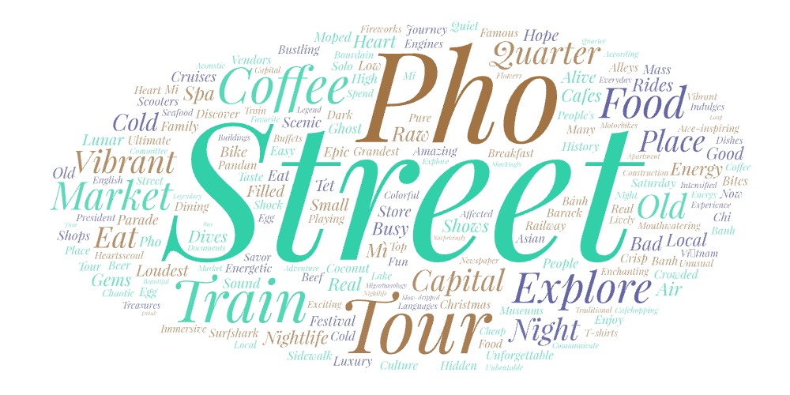
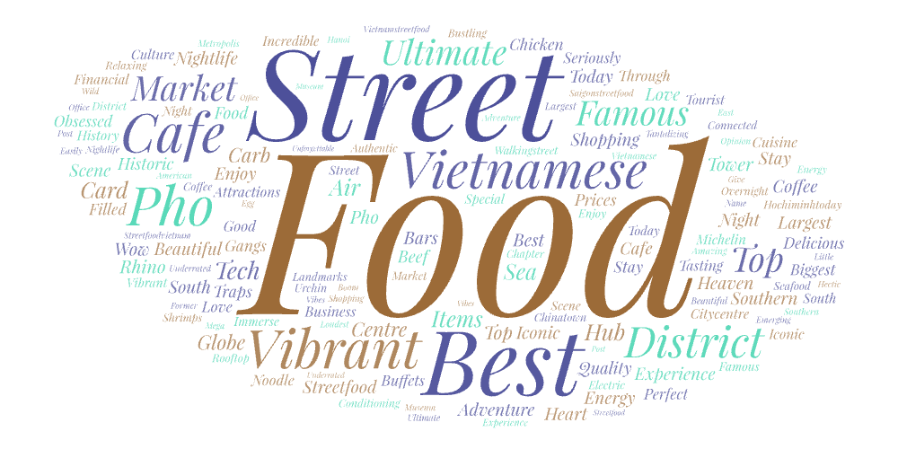

# Vietnam's Cities Youtube Crawler

## Topic and Parameters

Vietnam is a country known for its history and strong regional identities shaped by culture, climate and historical development. Tourism Tourism plays a major role in showcasing these regional differences as each city offers visitors a distinct experience. In this project, I decided to compare three of the top cities in Vietnam to explore how tourists engage with and perceive different regions of the country. Ho Chi Minh City, Hanoi, and Da Nang.
The parameters I used for the each are the followings:
- Ho Chi Minh City: ho chi minh, ho chi minh city, saigon
- Hanoi: hanoi, ha noi, hanoi vietnam
- Da Nang: danang, da nang, da nang vietnam

 ---

## Purpose of Project

This project is to compare different cities in Vietnam to highlight the unique characteristics that define each location. By analyzing how tourists perceive and experience these regions, the project will show patterns in tourism, cultural appeal, and regional identity. The findings are to help readers better understand what each destination is known for and how different areas of Vietnam attract and shape visitor experiences.

---

## Word Cloud Comparison

### Ho Chi Minh City
The top words are food, street, best, vibrant, showing that ho chi minh city is well known for their street food as the best and how the culture is vibrant. Additionally cafe, market, district and famous, giving us a glimspe of Ho Chi Minh's bustling economy. Even the less frequently used words supports the claims above of centre, shopping, delicious, and iconic. Ho Chi Minh City is the largest city in Southern Vietnam. You will find yourslef in a busy urban landscape with modern skyscrapers (District 1), colonial buildings, and traditional shopping areas.

### Da Nang
The top words are beach, beautiful, vibrant, night, international, and popular. We can see that Da Nang is a coastal city most loved for their beautiful beaches and is popular internationally. I can confirm that this city has a lot of tourist worthy landmarks and nightlife. Smaller words are iconic, shores, relaxing, nightlife, food, pristine which again proves how Da Nang has a good balance of a getaway and a fun nightlife. A walkway traces the coastline with an abundance of restaurants, cafés, and bars. Perfect to relax during the day, and enjoy a movie projection during the evenings and nights.

### Hanoi
The top words are street, pho, train, market, capital. The words are more specific here since Hanoi is the capital of Vietnam, known for their history and culture. Many people travel to Hanoi, where pho was originated from before becoming a global favorite and experience the Hanoi Train Street, which is a famous narrow alley where a train passes right in the center, extremely close to homes and cafes. The largest indoor market is also located in Hanoi, selling anywhere from clothing, home goods, and food. Other words being old, energetic, busy, unforgettable, amazing just goes to show the how the authenticity living of Hanoi leaves a lasting impression on everyone.

## Analysis
A common pattern I noticed with these words were how they were all related to food and vibrancy. Wherever you go in Vietnam, you will encounter many street vendors with amazing street food that gives you a true, authentic taste of their beloved cuisine, something tourists look for when travelling. The atmoshphere is also very vibrant and lively. With large populations constantly coming in, attractions are more catered for the best experience. But also, Vietnamese people are naturally very friendly and fun, contributing to the rich nightlife and positive interactions. Some words only differ because each city has their own quirks. To reiterate, Ho Chi Minh offers their electrifying hub, Da Nang is a coastal city with many breathtaking scenes, and Hanoi has amazing food and history. Technical wise, a lot of these videos have similar titles and descriptions to catch viewers eyes when skimming through their feed when learning more about Vietnam. This is done with trending areas and food in Vietnam, like seen with train and pho in Hanoi. Overall, Vietnam is a beautiful country with so many iconic, eccentric features that makes them one of the top must-visit location.

---

## Improvements

My research could be improved in the future by including specific search terms that focuses on different areas and experiences of each cities. Since the key terms were a little bit generalized, travel guide videos were more prevalent in the algorithm than in depth local videos. Additionally, I could extract videos from other platforms like Tiktok, Twitter, and Google for a more diverse perspective and take on Vietnam.

---

## Unexpected or Shocking Findings

Since I've been to Vietnam mutliple times, I found it surprising that there were many things I found memorable during my trip, not mentioned a lot on these videos. Also, there were a lot of unexpected words like Saily, which I learned is an affordable eSim for international travelling. I wonder if a lot of creators were promoting that specific brand or it's a known essential to have when travelling abroad. 

---

## Data

- [Da Nang Search Results](assets/danang3.csv)
- [Hanoi Search Results](assets/hanoi2.csv)
- [Ho Chi Minh Search Results](assets/hochiminh1.csv)

---

## WordClouds

### Da Nang

### Hanoi

### Ho Chi Minh

